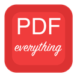

<h1 align="center">
  
  &nbsp;PDFeverything
</h1>

<p align="center">
  <b>🪄 The PDF Swiss Army Knife</b><br>
  <sub>Throw in PDFs, Word docs, PowerPoints, Excel sheets, images, text files —<br>get one clean PDF out the other end. No fuss.</sub>
</p>

<p align="center">
  <a href="https://github.com/Lezheng2333/PDFeverything/releases"></a>
  <a href="https://github.com/Lezheng2333/PDFeverything/releases/latest"></a>
  <a href="LICENSE"></a>
</p>

---

## ✨ Why PDFeverything?

You've been there: a Word report here, a PDF scan there, some photos of the whiteboard, an Excel chart… and now someone wants "*one combined PDF please, by 5pm*". 😤

**PDFeverything is built for exactly this moment.**

Drag everything in — any combination of PDFs, Word documents, PowerPoint decks, Excel spreadsheets, PNGs, JPEGs, text files — and it merges them into **one unified PDF**, in the order you decide, with progress you can watch.

| Platform | Download |
|---|---|
| 🍎 macOS (Apple Silicon) | [`PDFeverything_macOS.zip`](https://github.com/Lezheng2333/PDFeverything/releases/latest) |
| 🪟 Windows 10/11 (64-bit) | [`PDFeverything.exe`](https://github.com/Lezheng2333/PDFeverything/releases/latest) |

> 🔗 [**Latest Release →**](https://github.com/Lezheng2333/PDFeverything/releases/latest)

## 🆕 What's New in v1.1.0

- 🌐 **English UI** — toggle between Chinese and English in Settings > Language
- 🪟 **Windows Office COM** — native Word/PPT/Excel conversion on Windows (no fallback renderer needed!)
- 🤖 **AI Agent CLI mode** — `PDFeverything.exe merge -i a.pdf b.pdf -o out.pdf` from any terminal

---

## 🎯 The Killer Feature: Mixed-File Merge

```
📄 report.docx   (2 pages)
📊 chart.xlsx    (1 page)
🖼️ photo.jpg    (1 page)
📄 appendix.pdf  (5 pages)

         🪄  one click  🪄
              ↓
    ┌─────────────────────┐
    │   unified.pdf       │
    │   9 pages, in order │
    └─────────────────────┘
```

Every file goes through its own converter (AppleScript → Office on macOS, or pure-Python fallback), then everything gets stitched together. If one file fails, the rest still go through — you get a summary of what worked and what didn't.

## 🔧 Everything It Can Do

| Operation | What it does |
|---|---|
| 🔀 **Mixed Merge** | PDF + Word + PPT + Excel + images + text → one PDF |
| 🔗 **PDF Merge** | Combine multiple PDFs in any order |
| ✂️ **PDF Split** | Split by page, by chunks of N pages, or by custom ranges |
| 🖼️ **Images → PDF** | Turn a batch of images into a single PDF |
| 📝 **Word → PDF** | Convert `.docx` / `.doc` files to PDF |
| 📊 **PPT / Excel → PDF** | Convert `.pptx` and `.xlsx` files |
| 📄 **PDF → Images** | Export each PDF page as a PNG |
| 📤 **Extract Text** | Pull out all text from a PDF |
| 🖼️ **Extract Images** | Rip embedded images from a PDF |
| 🗜️ **Compress** | Shrink PDF file size (lossless / medium / aggressive) |
| 💧 **Watermark** | Stamp a text or PDF overlay on every page |
| 🔒 **Encrypt** | Set an open-password on a PDF |
| 🔓 **Decrypt** | Remove password protection |
| 🔄 **Rotate** | Rotate pages 90° / 180° / 270° |
| ℹ️ **Info** | Inspect page count, metadata, encryption status |

## 📥 Supported Inputs

| Category | Extensions |
|---|---|
| 📄 PDF | `.pdf` |
| 🖼️ Images | `.png` `.jpg` `.jpeg` `.gif` `.bmp` `.tiff` `.webp` |
| 📝 Word | `.docx` `.doc` `.rtf` |
| 📊 PowerPoint | `.pptx` `.ppt` |
| 📈 Excel | `.xlsx` `.xls` `.csv` |
| 📃 Text & Code | `.txt` `.md` `.json` `.xml` `.html` `.py` `.yml` … |

## 🖥️ The GUI

```
┌──────────────────────────────────────────────┐
│  📄 doc.pdf        [🔼] [🔽] [✖]            │
│  📊 data.xlsx      [🔼] [🔽] [✖]            │
│  🖼️ photo.jpg      [🔼] [🔽] [✖]            │
│  📝 report.docx    [🔼] [🔽] [✖]            │
│                                              │
│  ── drag & drop files here ──               │
│                                              │
│  [🔀 Merge All →]       [✂️ Split...]        │
│  [🗜️ Compress...]       [💧 Watermark...]    │
│  [🔒 Encrypt...]        [🔄 Rotate...]       │
│                                              │
│  ████████████░░░░░░  78%                     │
│  Converting: report.docx (3/5)...            │
└──────────────────────────────────────────────┘
```

- 🖱️ **Drag & drop** files from Finder / Explorer
- 🔄 **Reorder** with arrow buttons or by dragging inside the list
- ⚡ **Multi-threaded** — never freezes, always shows progress
- 🧠 **Smart buttons** — the UI adapts to what's in your file list
- 🌐 **Bilingual UI** — switch between Chinese and English (Settings > Language)

## 🤖 AI Agent Integration (MCP Server)

PDFeverything comes with a built-in **Model Context Protocol (MCP)** server. Any AI agent (Claude Desktop, Claude Code, Cursor, etc.) can discover all 13 PDF tools and call them directly — **no Python, no install, just the app file**.

### How it works

The same `.exe` / `.app` binary supports three modes:

| Mode | macOS | Windows |
|---|---|---|
| 🖥️ **GUI** | double-click `.app` | double-click `.exe` |
| ⌨️ **CLI** | ``/path/to/PDFeverything.app/Contents/MacOS/PDFeverything merge -i a.pdf -o out.pdf`` | `PDFeverything.exe merge -i a.pdf b.pdf -o out.pdf` |
| 🔌 **MCP** | ``/path/to/PDFeverything.app/Contents/MacOS/PDFeverything --mcp`` | `PDFeverything.exe --mcp` |

### Setup — Claude Desktop

Add to `~/.claude/claude_desktop_config.json`:

```json
{
  "mcpServers": {
    "pdfeverything": {
      "command": "/Applications/PDFeverything.app/Contents/MacOS/PDFeverything",
      "args": ["--mcp"]
    }
  }
}
```

**Windows:**
```json
{
  "mcpServers": {
    "pdfeverything": {
      "command": "C:\\Program Files\\PDFeverything\\PDFeverything.exe",
      "args": ["--mcp"]
    }
  }
}
```

### Setup — Claude Code

Add to `.claude/settings.json` in your project:

```json
{
  "mcpServers": {
    "pdfeverything": {
      "type": "stdio",
      "command": "/Applications/PDFeverything.app/Contents/MacOS/PDFeverything",
      "args": ["--mcp"]
    }
  }
}
```

### What the AI sees (13 tools)

Once connected, the agent automatically discovers these tools — no manual instruction needed:

| Tool | Description |
|---|---|
| `pdf_merge` | Merge multiple PDFs into one |
| `pdf_split` | Split PDF by pages or ranges |
| `pdf_info` | Get metadata (pages, size, author, etc.) |
| `pdf_extract_text` | Extract all text from PDF |
| `pdf_extract_images` | Extract embedded images |
| `pdf_to_images` | Convert PDF pages to PNG |
| `images_to_pdf` | Images → single PDF |
| `pdf_compress` | Reduce PDF file size |
| `pdf_watermark` | Add text watermark |
| `pdf_encrypt` | Set open password |
| `pdf_decrypt` | Remove password |
| `pdf_rotate` | Rotate pages 90/180/270° |
| `pdf_mixed_merge` | 🔥 Mixed files → unified PDF |

### Direct CLI mode (no MCP needed)

AI agents can also call the binary directly:

```bash
# macOS
/Applications/PDFeverything.app/Contents/MacOS/PDFeverything merge -i a.pdf b.pdf -o out.pdf
/Applications/PDFeverything.app/Contents/MacOS/PDFeverything info -i doc.pdf
/Applications/PDFeverything.app/Contents/MacOS/PDFeverything -h

# Windows
PDFeverything.exe merge -i a.pdf b.pdf -o out.pdf
PDFeverything.exe info -i doc.pdf
PDFeverything.exe -h
```

> 💡 **The `.app` and `.exe` are the SAME single binary.** Give it CLI args → headless mode. Give it `--mcp` → MCP server. No args → GUI. One file, three personalities.

## 🚀 Quick Start (for Developers)

```bash
# 1. Install dependencies
pip install PyQt6 PyMuPDF pypdf pikepdf pillow python-docx python-pptx openpyxl

# 2. Launch GUI
python main.py

# 3. Or use the CLI
python pdf_tool.py merge -i a.pdf b.pdf -o merged.pdf
python pdf_tool.py info -i document.pdf

# 4. Or start the MCP server
python mcp/server.py
```

### Build from Source

**Windows** (one-file portable exe):
```bash
pyinstaller build_windows.spec --noconfirm --clean
# → dist/PDFeverything.exe
```

**macOS** (app bundle):
```bash
pyinstaller PDFeverything.spec --noconfirm --clean
# → dist/PDFeverything.app
```

## 🧱 Tech Stack

| Layer | Tech |
|---|---|
| 🖼️ GUI | **PyQt6** — native look on both macOS & Windows |
| 🧠 PDF Engine | **PyMuPDF** + **pypdf** + **pikepdf** |
| 📝 Office Converters | **AppleScript** (macOS) / **COM** (Windows) / **python-docx** + **python-pptx** + **openpyxl** (fallback) |
| 📦 Packaging | **PyInstaller** (onefile on Windows, app bundle on macOS) |

## 📄 License

MIT — do whatever you want with it. [LICENSE](resources/LICENSE.txt)

---

<h2 align="center">🇨🇳 中文介绍</h2>

<p align="center">
  <b>🪄 PDF 万能工具箱</b><br>
  <sub>把 PDF、Word、PPT、Excel、图片、文本文件统统丢进来 ——<br>一键合成一个整整齐齐的 PDF。就这么简单。</sub>
</p>

### 🎯 核心功能：混合文件合并

```
📄 报告.docx     (2 页)
📊 图表.xlsx     (1 页)
🖼️ 照片.jpg     (1 页)
📄 附录.pdf      (5 页)

         🪄  一键合并  🪄
              ↓
    ┌─────────────────────┐
    │   统一输出.pdf       │
    │   9 页，顺序不变     │
    └─────────────────────┘
```

把不同类型的文件拖进来，每个文件经过专用转换器处理，然后按顺序合并。某个文件转换失败了也不影响其他的——最后会给你一份汇总报告。

### 🔧 全部功能

| 操作 | 说明 |
|---|---|
| 🔀 **混合合并** | PDF + Word + PPT + Excel + 图片 + 文本 → 一个 PDF |
| 🔗 **PDF 合并** | 多个 PDF 按任意顺序合并 |
| ✂️ **PDF 拆分** | 按页码、每 N 页或自定义范围拆分 |
| 🖼️ **图片 → PDF** | 多张图片一键合成为 PDF |
| 📝 **Word → PDF** | 转换 .docx / .doc 文件 |
| 📊 **PPT / Excel → PDF** | 转换 .pptx / .xlsx 文件 |
| 📄 **PDF → 图片** | 每页导出为 PNG |
| 📤 **提取文字** | 提取 PDF 中所有文字 |
| 🖼️ **提取图片** | 提取 PDF 中嵌入的图片 |
| 🗜️ **压缩** | 缩小 PDF 文件体积 |
| 💧 **水印** | 添加文字或 PDF 叠加水印 |
| 🔒 **加密 / 解密** | 设置或移除 PDF 打开密码 |
| 🔄 **旋转** | 旋转页面 90° / 180° / 270° |
| ℹ️ **信息** | 查看页数、元数据、加密状态 |

### 🆕 v1.1.0 新功能

- 🌐 **英文界面** — 设置 → 语言 切换中英文
- 🪟 **Windows Office 集成** — 调用本机 Word/PPT/Excel 高保真转换
- 🤖 **AI 调用的命令行模式** — `PDFeverything.exe merge -i a.pdf b.pdf -o out.pdf`

### 🖥️ 界面预览

```
┌──────────────────────────────────────────────┐
│  📄 doc.pdf        [🔼] [🔽] [✖]            │
│  📊 data.xlsx      [🔼] [🔽] [✖]            │
│  🖼️ photo.jpg      [🔼] [🔽] [✖]            │
│  📝 report.docx    [🔼] [🔽] [✖]            │
│                                              │
│  ── 拖放文件到此处 ──                        │
│                                              │
│  [🔀 合并为统一 PDF]   [✂️ 拆分...]          │
│  [🗜️ 压缩...]        [💧 水印...]          │
│  [🔒 加密...]        [🔄 旋转...]           │
│                                              │
│  ████████████░░░░░░  78%                     │
│  转换中: 报告.docx (3/5)...                  │
└──────────────────────────────────────────────┘
```

- 🖱️ 从资源管理器/Finder **拖放**文件
- 🔄 用按钮或拖动**调整顺序**
- ⚡ **多线程**处理 — 界面永不卡顿，实时进度条
- 🧠 **智能按钮** — 根据文件列表内容自动变化

### 🤖 命令行模式（供 AI Agent 调用）

编译好的 exe/app 可以直接作为**无头命令行工具**使用 — 无需安装 Python 或任何依赖：

```bash
PDFeverything.exe merge -i a.pdf b.pdf -o merged.pdf
PDFeverything.exe info -i document.pdf
PDFeverything.exe compress -i big.pdf -o small.pdf
PDFeverything.exe -h          # 查看完整帮助
PDFeverything.exe --version   # v1.1.0
```

任何 AI Agent（Claude、ChatGPT、自动化脚本）都能直接调用 PDFeverything，无需安装任何东西。

### 🚀 开发者快速开始

```bash
pip install PyQt6 PyMuPDF pypdf pikepdf pillow python-docx python-pptx openpyxl
python main.py            # 启动 GUI
python pdf_tool.py info -i document.pdf   # CLI 模式
```

### 📦 从源码构建

**Windows**（单文件便携版）:
```bash
pip install pywin32   # Windows Office COM 支持
pyinstaller build_windows.spec --noconfirm --clean
# → dist/PDFeverything.exe
```

**macOS**（App Bundle）:
```bash
pyinstaller PDFeverything.spec --noconfirm --clean
# → dist/PDFeverything.app
```

### 🧱 技术栈

| 层 | 技术 |
|---|---|
| 🖼️ 界面 | **PyQt6** — macOS / Windows 原生体验 |
| 🧠 PDF 引擎 | **PyMuPDF** + **pypdf** + **pikepdf** |
| 📝 Office 转换 | **AppleScript** (macOS) / **COM** (Windows) / **python-docx** + **python-pptx** + **openpyxl** (备选) |
| 📦 打包 | **PyInstaller** (Windows onefile / macOS app bundle) |

### 📄 许可证

MIT — 随便用。 [LICENSE](resources/LICENSE.txt)
